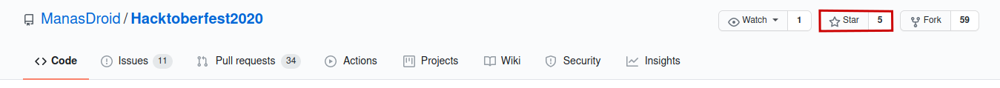

<h1 align="center"> Hacktoberfest-2020</h1>

   
    
   
   
   
   

**Register [here](https://hacktoberfest.digitalocean.com) for Hacktoberfest-2020 and make 4 pull requests (PRs) between October 1-31 to earn a free t-shirt.**

***  
# Hacktoberfest-2020 
 
### What is Hacktoberfest ?
Hacktoberfest is the easiest way to get into open source! Hacktoberfest is a month long festival of open source code presented by [Digital Ocean](https://www.digitalocean.com/), [Intel](https://hacktoberfest.digitalocean.com/intel.pdf) and [DEV](https://www.dev.to/) this year in 2020.

During the entire month of October 2020, all you have to do is contribute to any open source projects and open at least 4 pull requests. Yes, any project and any kind of contributions. It can be a be a bug fix, improvement, or even a documentation change! And win a T-Shirt and awesome stickers.

If you’ve never contributed to open source before, this is the perfect time to get started because Hacktoberfest provides a large list of available contribution opportunities (and yes, there are always plenty for beginners too).

***

### Why Should I Contribute?
Hacktoberfest has a simple and plain moto.
> Support open source and earn a limited edition T-shirt and few stickers!

So, yes! You can win a T-Shirt and few awesome stickers to attach on your laptop. On plus side, you will get into beautiful world of open source and get the international exposure. 

***

## This Repo is for beginner level programming contributors.

## You can contribute in any language you are comfortable with.

### **How to contribute:**
It's very easy. You don't need to be an expert in coding and programming. Just follow the procedure: 
1. Check the <a href="https://github.com/ManasDroid/Hacktoberfest2020/issues">issues</a> section.
2. You are welcome to contribute to any issue you are comfortable with.
3. Choose the language you are most comfortable with.
   - Please ensure that you add your work to the folder referenced in the issue.
4. You can also raise <a href="https://github.com/ManasDroid/Hacktoberfest2020/issues/new">Create New Issue</a> or Feature & create a new PR. I will then review it and merge it if is satisfactory.

New to Open Source? Don't know how to [`Create a Pull Request`](https://www.digitalocean.com/community/tutorials/how-to-create-a-pull-request-on-github)? read this documentation.

If you like the repo, feel free to star:star2: the repo.

### Made with ♥ by <a href="https://github.com/ManasDroid">ManasDroid</a>

